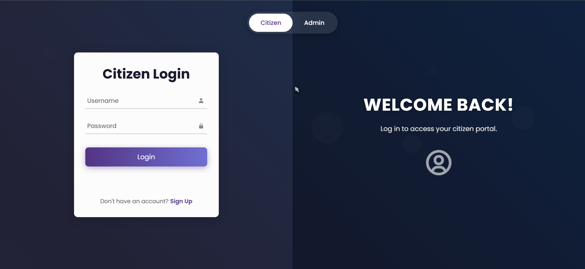
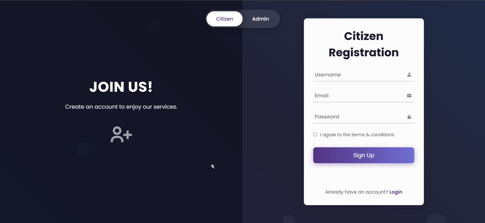
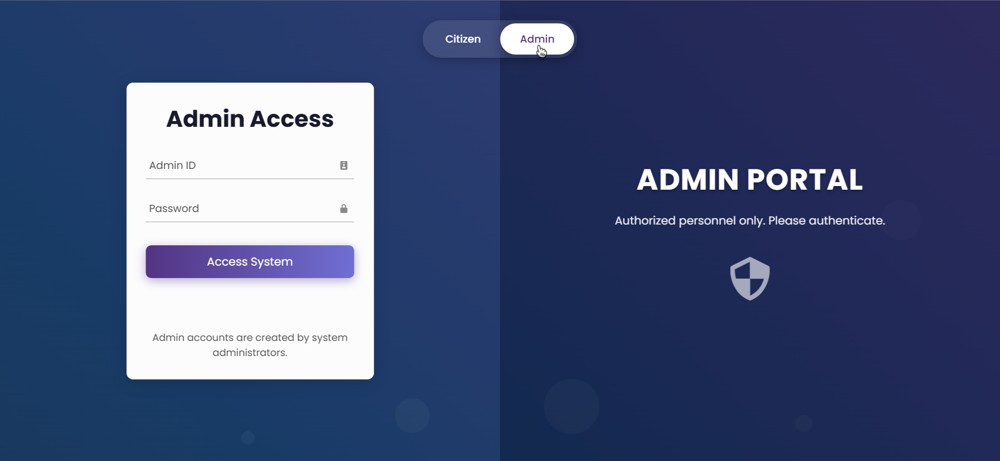

# Realtime-Report-Tracking
# Janvani - Civic Engagement & Issue Reporting Platform

## 🌟 Overview

`Janvani` is a web-based platform designed to bridge the communication gap between citizens and administrative bodies. It empowers citizens to easily report local issues, track their progress, and provides administrators with a dedicated panel to manage and address these concerns efficiently. This project aims to foster civic engagement and improve community problem-solving.

## ✨ Features

**Citizen Portal:**
*   **Secure Login & Registration:** Users can create accounts with password hashing for security.
*   **Personalized Dashboard:** Displays key statistics (reports closed/pending), overall progress, and recent reports. Includes a visual chart of report statuses.
*   **Interactive Report Submission:**
    *   **Multi-Level Categorization:** Intuitive card-based selection for main and sub-categories of issues.
    *   **Detailed Reporting:** Fields for title, description, and priority.
    *   **Media Uploads:** Option to attach photos/videos as evidence (frontend simulation, backend needed for storage).
    *   **Geolocation:** Automatic GPS coordinate fetching or manual address input.
*   **My Reports View:** Lists all submitted reports with filtering by status and a detail view for each.
*   **Settings:** Option to clear locally stored report data.
*   **Theme Toggle:** Light and Dark mode for user preference.

**Admin Portal:**
*   **Dedicated Login:** Secure access for administrators.
*   **Comprehensive Report Management:** View all reports submitted by citizens in a filterable and searchable table.
*   **Report Detail View:** Access full details of any report.
*   **Status Updates:** Admins can change the status of reports (e.g., Pending, In Review, Completed).
*   **Statistics (Placeholder):** Sections for future visual data analysis for administrators.
*   **Data Management:** Option to clear all citizen-submitted report data from local storage (for demo purposes).

## 🚀 Tech Stack

*   **Frontend:** HTML5, CSS3, Vanilla JavaScript
    *   Dynamic UI updates, view switching, and form handling.
    *   Client-side data storage using `localStorage` for demonstration.
    *   [Boxicons](https://boxicons.com/) for icons.
    *   [Chart.js](https://www.chartjs.org/) for data visualization.
*   **Backend:** Python 3 with Flask
    *   RESTful API for user authentication (registration, login) and report management (if fully implemented).
    *   Password hashing using `Flask-Bcrypt`.
    *   CORS handling with `Flask-CORS`.
    *   Data persistence using a `users.json` file (for demonstration; a database is recommended for production).
*   **(Optional) Deployment:** (Mention if you plan to deploy, e.g., "Planned deployment using Docker and a PaaS like Render/Heroku.")

## 🛠️ Setup & Installation

**Prerequisites:**
*   Python 3.x
*   `pip` (Python package installer)
*   A modern web browser

**Backend Setup (Flask Server):**

1.  **Clone the repository:**
    ```bash
    git clone https://github.com/bhavyab212/Realtime-Report-Tracking.git
    cd Realtime-Report-Tracking
    ```
2.  **Create and activate a virtual environment (recommended):**
    ```bash
    python -m venv venv
    # Windows
    venv\Scripts\activate
    # macOS/Linux
    source venv/bin/activate
    ```
3.  **Install Python dependencies:**
    ```bash
    pip install Flask Flask-Bcrypt Flask-CORS
    # Or if you have a requirements.txt:
    # pip install -r requirements.txt
    ```
4.  **Run the Flask development server:**
    ```bash
    python app.py
    ```
    The backend API will typically be running on `http://127.0.0.1:5000/`.

**Frontend Access:**

*   If Flask is configured to serve the frontend (as in the "Method 1" setup):
    Navigate to `http://127.0.0.1:5000/` in your web browser.
*   If you are serving the frontend static files separately (e.g., using VS Code Live Server or another simple HTTP server for `index.html`):
    Open `index.html` through your local web server (e.g., `http://127.0.0.1:5500/` if using Live Server on port 5500). Ensure the `API_BASE_URL` in `script.js` is correctly pointing to your running Flask backend (`http://127.0.0.1:5000`).

**Default Admin Credentials (for demonstration - defined in `app.py` or `users.json` initially):**
*   **Username:** `admin` (or as defined)
*   **Password:** `adminpassword` (or as defined)
    *   *Please change these default credentials in the `users.json` file or `app.py` for any deployment!*

## 📖 Usage

1.  **Citizen:**
    *   Navigate to the main page.
    *   Register a new citizen account or log in with existing credentials.
    *   Explore the dashboard, view report statistics.
    *   Click "Report a New Issue" to go through the multi-step reporting process.
    *   View your submitted reports in the "My Reports" section.
    *   Change the theme using the toggle button.
2.  **Administrator:**
    *   On the login page, select the "Admin" user type.
    *   Log in using the admin credentials.
    *   View and manage all submitted citizen reports.
    *   Filter reports by status or search for specific reports.
    *   Click on a report to view its details and update its status.
    *   (Optional) Clear all report data from local storage via the Settings page.

## 📸 Screenshots

Here's a glimpse of the "Janvani" platform:

### Login & Registration
<p align="center">
  
  
  <br>
  
</p>
*Caption: Secure and distinct login/registration flows for citizens and administrators.*

---

### Citizen Dashboard & Reporting
<p align="center">
  
  
  
  <br>
  
  
  
  <br>
  
  
  
</p>
*Caption: Citizens have a personalized dashboard to report issues through a guided multi-level category selection, upload evidence, specify location, and track the status of their submissions.*

---

### Admin Dashboard
<p align="center">
   <!-- Assumed filename -->
   <!-- Assumed filename -->
  <br>
  
</p>
*Caption: Administrators have a comprehensive panel to view all citizen reports, filter them, inspect details, update statuses, and view overall statistics.*

##  Future Development

*   **Full Backend Integration:** Migrate report data storage from `localStorage` to a robust database (e.g., PostgreSQL, SQLite) managed by the Flask backend.
*   **Real-time Notifications:** Implement notifications for citizens when their report status is updated by an admin.
*   **Admin User Management:** Allow super-admins to create and manage other admin accounts.
*   **Advanced Analytics:** More detailed charts and statistics for administrators.
*   **File Storage:** Implement proper server-side storage for uploaded images/videos.
*   **User Profile Management:** Allow users to update their profile information and change passwords.
*   **Deployment:** Deploy the application to a cloud platform for public access.

## 🤝 Contributing

Contributions, issues, and feature requests are welcome! Feel free to check [issues page](https://github.com/bhavyab212/Realtime-Report-Tracking/issues).

This will give visitors to your GitHub page a good understanding of what your project is about and how to get it running. Good luck!
